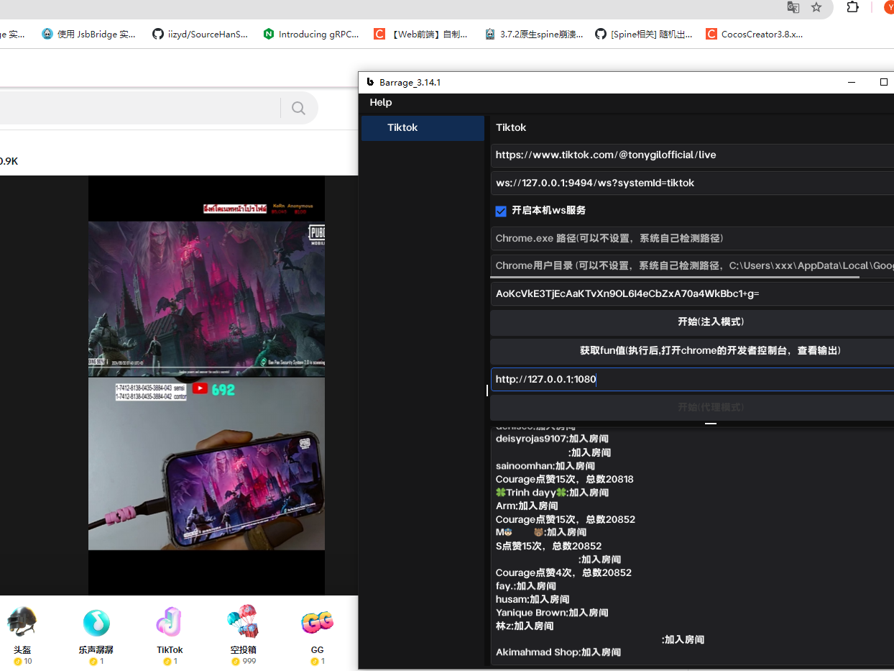
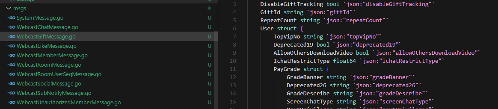

# tkbarrage
Tiktok弹幕抓取 发送websocket服务器   
获取客户端,请联系 qq: 174389107  
Go语言实现，js注入
弹幕游戏服务器开发，房间消息转发，单台服务器24小时压测支持1000主播同时播，1000 qps  


#数据结构示例



```go
package msgs
type WebcastGiftMessage struct {
	DisableGiftTracking bool `json:"disableGiftTracking"`
	GiftId string `json:"giftId"`
	RepeatCount string `json:"repeatCount"`
	User struct {
		TopVipNo string `json:"topVipNo"`
		Deprecated19 bool `json:"deprecated19"`
		AllowOthersDownloadVideo bool `json:"allowOthersDownloadVideo"`
		IchatRestrictType float64 `json:"ichatRestrictType"`
		PayGrade struct {
			GradeBanner string `json:"gradeBanner"`
			Deprecated26 string `json:"deprecated26"`
			GradeDescribe string `json:"gradeDescribe"`
			ScreenChatType string `json:"screenChatType"`
			NextPrivileges string `json:"nextPrivileges"`
			Score string `json:"score"`
			Deprecated22 string `json:"deprecated22"`
			UpgradeNeedConsume string `json:"upgradeNeedConsume"`
			Name string `json:"name"`
			Level string `json:"level"`
			Deprecated20 string `json:"deprecated20"`
			NextName string `json:"nextName"`
			Deprecated23 string `json:"deprecated23"`
			Deprecated24 string `json:"deprecated24"`
			Deprecated25 string `json:"deprecated25"`
		} `json:"payGrade"`
		ModifyTime string `json:"modifyTime"`
		TicketCount string `json:"ticketCount"`
		BadgeListList []*struct {
			Position float64 `json:"position"`
			DisplayStatus float64 `json:"displayStatus"`
			GreyedByClient string `json:"greyedByClient"`
			ExhibitionType float64 `json:"exhibitionType"`
			Openweburl string `json:"openweburl"`
			DisplayType float64 `json:"displayType"`
			PriorityType float64 `json:"priorityType"`
			SceneType float64 `json:"sceneType"`
			Display bool `json:"display"`
			PrivilegeLogExtra struct {
				DataVersion string `json:"dataVersion"`
				PrivilegeId string `json:"privilegeId"`
				PrivilegeVersion string `json:"privilegeVersion"`
				PrivilegeOrderId string `json:"privilegeOrderId"`
				Level string `json:"level"`
			} `json:"privilegeLogExtra"`
			Combine struct {
				IconAutoMirrored bool `json:"iconAutoMirrored"`
				PersonalCardShowStyle float64 `json:"personalCardShowStyle"`
				DisplayType float64 `json:"displayType"`
				Icon struct {
					Width string `json:"width"`
					AvgColor string `json:"avgColor"`
					ImageType float64 `json:"imageType"`
					OpenWebUrl string `json:"openWebUrl"`
					IsAnimated bool `json:"isAnimated"`
					UrlListList []string `json:"urlListList"`
					Uri string `json:"uri"`
					Height string `json:"height"`
				} `json:"icon"`
				FontStyle struct {
					FontSize float64 `json:"fontSize"`
					FontWidth float64 `json:"fontWidth"`
					FontColor string `json:"fontColor"`
					BorderColor string `json:"borderColor"`
				} `json:"fontStyle"`
				BackgroundDarkMode struct {
					Image struct {
						Uri string `json:"uri"`
						Height string `json:"height"`
						Width string `json:"width"`
						AvgColor string `json:"avgColor"`
						ImageType float64 `json:"imageType"`
						OpenWebUrl string `json:"openWebUrl"`
						IsAnimated bool `json:"isAnimated"`
					} `json:"image"`
					BackgroundColorCode string `json:"backgroundColorCode"`
					BorderColorCode string `json:"borderColorCode"`
				} `json:"backgroundDarkMode"`
				BackgroundAutoMirrored bool `json:"backgroundAutoMirrored"`
				Str string `json:"str"`
				Background struct {
					Image struct {
						Uri string `json:"uri"`
						Height string `json:"height"`
						Width string `json:"width"`
						AvgColor string `json:"avgColor"`
						ImageType float64 `json:"imageType"`
						OpenWebUrl string `json:"openWebUrl"`
						IsAnimated bool `json:"isAnimated"`
					} `json:"image"`
					BackgroundColorCode string `json:"backgroundColorCode"`
					BorderColorCode string `json:"borderColorCode"`
				} `json:"background"`
				PublicScreenShowStyle float64 `json:"publicScreenShowStyle"`
				RanklistOnlineAudienceShowStyle float64 `json:"ranklistOnlineAudienceShowStyle"`
				MultiGuestShowStyle float64 `json:"multiGuestShowStyle"`
				Padding struct {
					UseSpecific bool `json:"useSpecific"`
					MiddlePadding float64 `json:"middlePadding"`
					BadgeWidth float64 `json:"badgeWidth"`
					LeftPadding float64 `json:"leftPadding"`
					RightPadding float64 `json:"rightPadding"`
					IconTopPadding float64 `json:"iconTopPadding"`
					IconBottomPadding float64 `json:"iconBottomPadding"`
					VerticalPaddingRule float64 `json:"verticalPaddingRule"`
					HorizontalPaddingRule float64 `json:"horizontalPaddingRule"`
				} `json:"padding"`
				ProfileCardPanel struct {
					UseNewProfileCardStyle bool `json:"useNewProfileCardStyle"`
					BadgeTextPosition float64 `json:"badgeTextPosition"`
					ProjectionConfig struct {
						UseProjection bool `json:"useProjection"`
						Icon struct {
							Uri string `json:"uri"`
							Height string `json:"height"`
							Width string `json:"width"`
							AvgColor string `json:"avgColor"`
							ImageType float64 `json:"imageType"`
							OpenWebUrl string `json:"openWebUrl"`
							IsAnimated bool `json:"isAnimated"`
						} `json:"icon"`
					} `json:"projectionConfig"`
					ProfileContent struct {
						UseContent bool `json:"useContent"`
					} `json:"profileContent"`
				} `json:"profileCardPanel"`
			} `json:"combine"`
		} `json:"badgeListList"`
		Deprecated28 bool `json:"deprecated28"`
		IdStr string `json:"idStr"`
		PushIchat bool `json:"pushIchat"`
		Deprecated3 float64 `json:"deprecated3"`
		PayScore string `json:"payScore"`
		Deprecated21 string `json:"deprecated21"`
		Deprecated29 string `json:"deprecated29"`
		WithCarManagementPermission bool `json:"withCarManagementPermission"`
		Deprecated8 float64 `json:"deprecated8"`
		UserAttr struct {
			IsSuperAdmin bool `json:"isSuperAdmin"`
			MuteDuration string `json:"muteDuration"`
			IsMuted bool `json:"isMuted"`
			IsAdmin bool `json:"isAdmin"`
		} `json:"userAttr"`
		DisplayId string `json:"displayId"`
		Deprecated15 float64 `json:"deprecated15"`
		BlockStatus float64 `json:"blockStatus"`
		Constellation string `json:"constellation"`
		FollowStatus string `json:"followStatus"`
		PayScores string `json:"payScores"`
		ShareQrcodeUri string `json:"shareQrcodeUri"`
		PushStatus bool `json:"pushStatus"`
		PushDigg bool `json:"pushDigg"`
		AllowFindByContacts bool `json:"allowFindByContacts"`
		AllowOthersDownloadWhenSharingVideo bool `json:"allowOthersDownloadWhenSharingVideo"`
		EnableIchatImg string `json:"enableIchatImg"`
		Deprecated17 bool `json:"deprecated17"`
		IsBlock bool `json:"isBlock"`
		Deprecated7 string `json:"deprecated7"`
		FollowInfo struct {
			PushStatus string `json:"pushStatus"`
			FollowingCount string `json:"followingCount"`
			FollowerCount string `json:"followerCount"`
			FollowStatus string `json:"followStatus"`
		} `json:"followInfo"`
		LinkMicStats float64 `json:"linkMicStats"`
		PushCommentStatus bool `json:"pushCommentStatus"`
		PushVideoRecommend bool `json:"pushVideoRecommend"`
		AvatarThumb struct {
			Width string `json:"width"`
			AvgColor string `json:"avgColor"`
			ImageType float64 `json:"imageType"`
			OpenWebUrl string `json:"openWebUrl"`
			IsAnimated bool `json:"isAnimated"`
			UrlListList []string `json:"urlListList"`
			Uri string `json:"uri"`
			Height string `json:"height"`
		} `json:"avatarThumb"`
		SecUid string `json:"secUid"`
		Deprecated13 float64 `json:"deprecated13"`
		AllowUnfollowerComment bool `json:"allowUnfollowerComment"`
		Deprecated16 bool `json:"deprecated16"`
		FanTicketCount string `json:"fanTicketCount"`
		Deprecated6 float64 `json:"deprecated6"`
		Deprecated1 string `json:"deprecated1"`
		Nickname string `json:"nickname"`
		Deprecated2 float64 `json:"deprecated2"`
		IsFollowing bool `json:"isFollowing"`
		Id string `json:"id"`
		NeedProfileGuide bool `json:"needProfileGuide"`
		PushFollow bool `json:"pushFollow"`
		FoldStrangerChat bool `json:"foldStrangerChat"`
		UserRole float64 `json:"userRole"`
		Deprecated12 float64 `json:"deprecated12"`
		AllowShareShowProfile bool `json:"allowShareShowProfile"`
		ScmLabel string `json:"scmLabel"`
		SpecialId string `json:"specialId"`
		Deprecated5 string `json:"deprecated5"`
		AllowShowInGossip bool `json:"allowShowInGossip"`
		AllowStrangeComment bool `json:"allowStrangeComment"`
		BgImgUrl string `json:"bgImgUrl"`
		CommentRestrict float64 `json:"commentRestrict"`
		BioDescription string `json:"bioDescription"`
		Status float64 `json:"status"`
		AllowUseLinkmic bool `json:"allowUseLinkmic"`
		Exp float64 `json:"exp"`
		PushFriendAction bool `json:"pushFriendAction"`
		Deprecated4 string `json:"deprecated4"`
		WithCommercePermission bool `json:"withCommercePermission"`
		WithFusionShopEntry bool `json:"withFusionShopEntry"`
		AllowShowMyAction bool `json:"allowShowMyAction"`
		DisableIchat float64 `json:"disableIchat"`
		PushVideoPost bool `json:"pushVideoPost"`
		Verified bool `json:"verified"`
		Deprecated18 string `json:"deprecated18"`
		IsFollower bool `json:"isFollower"`
		VerifiedReason string `json:"verifiedReason"`
		VerifiedContent string `json:"verifiedContent"`
		Secret float64 `json:"secret"`
		CreateTime string `json:"createTime"`
	} `json:"user"`
	RepeatEnd float64 `json:"repeatEnd"`
	Gift struct {
		Combo bool `json:"combo"`
		PrimaryEffectId string `json:"primaryEffectId"`
		Name string `json:"name"`
		Icon struct {
			UrlListList []string `json:"urlListList"`
			Uri string `json:"uri"`
			Height string `json:"height"`
			Width string `json:"width"`
			AvgColor string `json:"avgColor"`
			ImageType float64 `json:"imageType"`
			OpenWebUrl string `json:"openWebUrl"`
			IsAnimated bool `json:"isAnimated"`
		} `json:"icon"`
		IsBoxGift bool `json:"isBoxGift"`
		GiftRankRecommendInfo string `json:"giftRankRecommendInfo"`
		GiftSubType float64 `json:"giftSubType"`
		ForLinkmic bool `json:"forLinkmic"`
		Type float64 `json:"type"`
		DiamondCount float64 `json:"diamondCount"`
		IsRandomGift bool `json:"isRandomGift"`
		GiftVerticalScenariosList []float64 `json:"giftVerticalScenariosList"`
		Duration string `json:"duration"`
		Id string `json:"id"`
		GoldEffect string `json:"goldEffect"`
		Image struct {
			Height string `json:"height"`
			Width string `json:"width"`
			AvgColor string `json:"avgColor"`
			ImageType float64 `json:"imageType"`
			OpenWebUrl string `json:"openWebUrl"`
			IsAnimated bool `json:"isAnimated"`
			UrlListList []string `json:"urlListList"`
			Uri string `json:"uri"`
		} `json:"image"`
		Describe string `json:"describe"`
		IsDisplayedOnPanel bool `json:"isDisplayedOnPanel"`
		IsBroadcastGift bool `json:"isBroadcastGift"`
		IsEffectBefview bool `json:"isEffectBefview"`
		CanPutInGiftBox bool `json:"canPutInGiftBox"`
	} `json:"gift"`
	MonitorInfo struct {
		AnchorId string `json:"anchorId"`
		SendGiftProfitApiStartMs string `json:"sendGiftProfitApiStartMs"`
		FromVersion string `json:"fromVersion"`
		FromPlatform string `json:"fromPlatform"`
		ProfitapiMessageDur string `json:"profitapiMessageDur"`
		SendGiftProfitCoreStartMs string `json:"sendGiftProfitCoreStartMs"`
		SendGiftReqStartMs string `json:"sendGiftReqStartMs"`
		SendGiftSendMessageSuccessMs string `json:"sendGiftSendMessageSuccessMs"`
		SendProfitapiDur string `json:"sendProfitapiDur"`
		ToUserId string `json:"toUserId"`
		SendGiftStartClientLocalMs string `json:"sendGiftStartClientLocalMs"`
	} `json:"monitorInfo"`
	FanTicketCount string `json:"fanTicketCount"`
	GroupCount string `json:"groupCount"`
	LinkmicGiftExpressionStrategy float64 `json:"linkmicGiftExpressionStrategy"`
	MonitorExtra string `json:"monitorExtra"`
	OrderId string `json:"orderId"`
	Common struct {
		PriorityScore string `json:"priorityScore"`
		MsgProcessFilterK string `json:"msgProcessFilterK"`
		FromIdc string `json:"fromIdc"`
		ToIdc string `json:"toIdc"`
		RoomMessageHeatLevel string `json:"roomMessageHeatLevel"`
		DispatchStrategy float64 `json:"dispatchStrategy"`
		MsgId string `json:"msgId"`
		RoomId string `json:"roomId"`
		CreateTime string `json:"createTime"`
		Monitor float64 `json:"monitor"`
		DisplayText struct {
			PiecesList []*struct {
				Type float64 `json:"type"`
				Format struct {
					UseHeighLightColor bool `json:"useHeighLightColor"`
					UseRemoteClor bool `json:"useRemoteClor"`
					Color string `json:"color"`
					Bold bool `json:"bold"`
					Italic bool `json:"italic"`
					Weight float64 `json:"weight"`
					ItalicAngle float64 `json:"italicAngle"`
					FontSize float64 `json:"fontSize"`
				} `json:"format"`
				StringValue string `json:"stringValue"`
				UserValue struct {
					User struct {
						EnableIchatImg string `json:"enableIchatImg"`
						FollowStatus string `json:"followStatus"`
						ShareQrcodeUri string `json:"shareQrcodeUri"`
						Deprecated8 float64 `json:"deprecated8"`
						Deprecated15 float64 `json:"deprecated15"`
						AllowStrangeComment bool `json:"allowStrangeComment"`
						Deprecated21 string `json:"deprecated21"`
						VerifiedContent string `json:"verifiedContent"`
						SecUid string `json:"secUid"`
						Deprecated1 string `json:"deprecated1"`
						Deprecated7 string `json:"deprecated7"`
						Secret float64 `json:"secret"`
						DisplayId string `json:"displayId"`
						AllowFindByContacts bool `json:"allowFindByContacts"`
						AllowUnfollowerComment bool `json:"allowUnfollowerComment"`
						PushIchat bool `json:"pushIchat"`
						Status float64 `json:"status"`
						SpecialId string `json:"specialId"`
						LinkMicStats float64 `json:"linkMicStats"`
						PushCommentStatus bool `json:"pushCommentStatus"`
						BlockStatus float64 `json:"blockStatus"`
						IsBlock bool `json:"isBlock"`
						Deprecated4 string `json:"deprecated4"`
						Deprecated6 float64 `json:"deprecated6"`
						AllowOthersDownloadWhenSharingVideo bool `json:"allowOthersDownloadWhenSharingVideo"`
						BgImgUrl string `json:"bgImgUrl"`
						VerifiedReason string `json:"verifiedReason"`
						CreateTime string `json:"createTime"`
						FollowInfo struct {
							PushStatus string `json:"pushStatus"`
							FollowingCount string `json:"followingCount"`
							FollowerCount string `json:"followerCount"`
							FollowStatus string `json:"followStatus"`
						} `json:"followInfo"`
						WithFusionShopEntry bool `json:"withFusionShopEntry"`
						IsFollowing bool `json:"isFollowing"`
						PushStatus bool `json:"pushStatus"`
						Id string `json:"id"`
						ModifyTime string `json:"modifyTime"`
						IsFollower bool `json:"isFollower"`
						PushFriendAction bool `json:"pushFriendAction"`
						WithCarManagementPermission bool `json:"withCarManagementPermission"`
						ScmLabel string `json:"scmLabel"`
						AvatarThumb struct {
							IsAnimated bool `json:"isAnimated"`
							UrlListList []string `json:"urlListList"`
							Uri string `json:"uri"`
							Height string `json:"height"`
							Width string `json:"width"`
							AvgColor string `json:"avgColor"`
							ImageType float64 `json:"imageType"`
							OpenWebUrl string `json:"openWebUrl"`
						} `json:"avatarThumb"`
						Verified bool `json:"verified"`
						WithCommercePermission bool `json:"withCommercePermission"`
						AllowUseLinkmic bool `json:"allowUseLinkmic"`
						PayScores string `json:"payScores"`
						TopVipNo string `json:"topVipNo"`
						UserRole float64 `json:"userRole"`
						DisableIchat float64 `json:"disableIchat"`
						Deprecated5 string `json:"deprecated5"`
						Deprecated19 bool `json:"deprecated19"`
						AllowShareShowProfile bool `json:"allowShareShowProfile"`
						Exp float64 `json:"exp"`
						PushFollow bool `json:"pushFollow"`
						IchatRestrictType float64 `json:"ichatRestrictType"`
						BioDescription string `json:"bioDescription"`
						Deprecated12 float64 `json:"deprecated12"`
						AllowShowInGossip bool `json:"allowShowInGossip"`
						CommentRestrict float64 `json:"commentRestrict"`
						Deprecated18 string `json:"deprecated18"`
						FanTicketCount string `json:"fanTicketCount"`
						NeedProfileGuide bool `json:"needProfileGuide"`
						PayScore string `json:"payScore"`
						TicketCount string `json:"ticketCount"`
						BadgeListList []*struct {
							GreyedByClient string `json:"greyedByClient"`
							ExhibitionType float64 `json:"exhibitionType"`
							Openweburl string `json:"openweburl"`
							DisplayType float64 `json:"displayType"`
							SceneType float64 `json:"sceneType"`
							Position float64 `json:"position"`
							DisplayStatus float64 `json:"displayStatus"`
							Display bool `json:"display"`
							PrivilegeLogExtra struct {
								Level string `json:"level"`
								DataVersion string `json:"dataVersion"`
								PrivilegeId string `json:"privilegeId"`
								PrivilegeVersion string `json:"privilegeVersion"`
								PrivilegeOrderId string `json:"privilegeOrderId"`
							} `json:"privilegeLogExtra"`
							Combine struct {
								Icon struct {
									OpenWebUrl string `json:"openWebUrl"`
									IsAnimated bool `json:"isAnimated"`
									UrlListList []string `json:"urlListList"`
									Uri string `json:"uri"`
									Height string `json:"height"`
									Width string `json:"width"`
									AvgColor string `json:"avgColor"`
									ImageType float64 `json:"imageType"`
								} `json:"icon"`
								Str string `json:"str"`
								BackgroundDarkMode struct {
									Image struct {
										Uri string `json:"uri"`
										Height string `json:"height"`
										Width string `json:"width"`
										AvgColor string `json:"avgColor"`
										ImageType float64 `json:"imageType"`
										OpenWebUrl string `json:"openWebUrl"`
										IsAnimated bool `json:"isAnimated"`
									} `json:"image"`
									BackgroundColorCode string `json:"backgroundColorCode"`
									BorderColorCode string `json:"borderColorCode"`
								} `json:"backgroundDarkMode"`
								RanklistOnlineAudienceShowStyle float64 `json:"ranklistOnlineAudienceShowStyle"`
								DisplayType float64 `json:"displayType"`
								Padding struct {
									MiddlePadding float64 `json:"middlePadding"`
									IconTopPadding float64 `json:"iconTopPadding"`
									HorizontalPaddingRule float64 `json:"horizontalPaddingRule"`
									VerticalPaddingRule float64 `json:"verticalPaddingRule"`
									UseSpecific bool `json:"useSpecific"`
									BadgeWidth float64 `json:"badgeWidth"`
									LeftPadding float64 `json:"leftPadding"`
									RightPadding float64 `json:"rightPadding"`
									IconBottomPadding float64 `json:"iconBottomPadding"`
								} `json:"padding"`
								Background struct {
									Image struct {
										Height string `json:"height"`
										Width string `json:"width"`
										AvgColor string `json:"avgColor"`
										ImageType float64 `json:"imageType"`
										OpenWebUrl string `json:"openWebUrl"`
										IsAnimated bool `json:"isAnimated"`
										Uri string `json:"uri"`
									} `json:"image"`
									BackgroundColorCode string `json:"backgroundColorCode"`
									BorderColorCode string `json:"borderColorCode"`
								} `json:"background"`
								IconAutoMirrored bool `json:"iconAutoMirrored"`
								MultiGuestShowStyle float64 `json:"multiGuestShowStyle"`
								PersonalCardShowStyle float64 `json:"personalCardShowStyle"`
								FontStyle struct {
									FontSize float64 `json:"fontSize"`
									FontWidth float64 `json:"fontWidth"`
									FontColor string `json:"fontColor"`
									BorderColor string `json:"borderColor"`
								} `json:"fontStyle"`
								ProfileCardPanel struct {
									UseNewProfileCardStyle bool `json:"useNewProfileCardStyle"`
									BadgeTextPosition float64 `json:"badgeTextPosition"`
									ProjectionConfig struct {
										UseProjection bool `json:"useProjection"`
										Icon struct {
											Uri string `json:"uri"`
											Height string `json:"height"`
											Width string `json:"width"`
											AvgColor string `json:"avgColor"`
											ImageType float64 `json:"imageType"`
											OpenWebUrl string `json:"openWebUrl"`
											IsAnimated bool `json:"isAnimated"`
										} `json:"icon"`
									} `json:"projectionConfig"`
									ProfileContent struct {
										UseContent bool `json:"useContent"`
									} `json:"profileContent"`
								} `json:"profileCardPanel"`
								BackgroundAutoMirrored bool `json:"backgroundAutoMirrored"`
								PublicScreenShowStyle float64 `json:"publicScreenShowStyle"`
							} `json:"combine"`
							PriorityType float64 `json:"priorityType"`
						} `json:"badgeListList"`
						FoldStrangerChat bool `json:"foldStrangerChat"`
						Deprecated3 float64 `json:"deprecated3"`
						PayGrade struct {
							GradeDescribe string `json:"gradeDescribe"`
							Deprecated20 string `json:"deprecated20"`
							Deprecated23 string `json:"deprecated23"`
							Deprecated26 string `json:"deprecated26"`
							Score string `json:"score"`
							GradeBanner string `json:"gradeBanner"`
							Name string `json:"name"`
							Deprecated22 string `json:"deprecated22"`
							Deprecated25 string `json:"deprecated25"`
							ScreenChatType string `json:"screenChatType"`
							NextName string `json:"nextName"`
							Level string `json:"level"`
							Deprecated24 string `json:"deprecated24"`
							UpgradeNeedConsume string `json:"upgradeNeedConsume"`
							NextPrivileges string `json:"nextPrivileges"`
						} `json:"payGrade"`
						UserAttr struct {
							MuteDuration string `json:"muteDuration"`
							IsMuted bool `json:"isMuted"`
							IsAdmin bool `json:"isAdmin"`
							IsSuperAdmin bool `json:"isSuperAdmin"`
						} `json:"userAttr"`
						Constellation string `json:"constellation"`
						AllowOthersDownloadVideo bool `json:"allowOthersDownloadVideo"`
						Deprecated28 bool `json:"deprecated28"`
						PushDigg bool `json:"pushDigg"`
						PushVideoPost bool `json:"pushVideoPost"`
						PushVideoRecommend bool `json:"pushVideoRecommend"`
						Deprecated2 float64 `json:"deprecated2"`
						AllowShowMyAction bool `json:"allowShowMyAction"`
						Deprecated16 bool `json:"deprecated16"`
						IdStr string `json:"idStr"`
						Nickname string `json:"nickname"`
						Deprecated13 float64 `json:"deprecated13"`
						Deprecated29 string `json:"deprecated29"`
						Deprecated17 bool `json:"deprecated17"`
					} `json:"user"`
					WithColon bool `json:"withColon"`
				} `json:"userValue"`
			} `json:"piecesList"`
			Key string `json:"key"`
			DefaultPattern string `json:"defaultPattern"`
			DefaultFormat struct {
				FontSize float64 `json:"fontSize"`
				UseHeighLightColor bool `json:"useHeighLightColor"`
				UseRemoteClor bool `json:"useRemoteClor"`
				Color string `json:"color"`
				Bold bool `json:"bold"`
				Italic bool `json:"italic"`
				Weight float64 `json:"weight"`
				ItalicAngle float64 `json:"italicAngle"`
			} `json:"defaultFormat"`
		} `json:"displayText"`
		AnchorFoldType string `json:"anchorFoldType"`
		MsgProcessFilterV string `json:"msgProcessFilterV"`
		Method string `json:"method"`
		IsShowMsg bool `json:"isShowMsg"`
		LogId string `json:"logId"`
		ClientSendTime string `json:"clientSendTime"`
		Describe string `json:"describe"`
		FoldType string `json:"foldType"`
		AnchorPriorityScore string `json:"anchorPriorityScore"`
		FoldTypeForWeb string `json:"foldTypeForWeb"`
		AnchorFoldTypeForWeb string `json:"anchorFoldTypeForWeb"`
	} `json:"common"`
	ComboCount string `json:"comboCount"`
	GroupId string `json:"groupId"`
	RoomFanTicketCount string `json:"roomFanTicketCount"`
	SendType string `json:"sendType"`
	BannedDisplayEffects string `json:"bannedDisplayEffects"`
	UserIdentity struct {
		IsSubscriberOfAnchor bool `json:"isSubscriberOfAnchor"`
		IsMutualFollowingWithAnchor bool `json:"isMutualFollowingWithAnchor"`
		IsFollowerOfAnchor bool `json:"isFollowerOfAnchor"`
		IsModeratorOfAnchor bool `json:"isModeratorOfAnchor"`
		IsAnchor bool `json:"isAnchor"`
		IsGiftGiverOfAnchor bool `json:"isGiftGiverOfAnchor"`
	} `json:"userIdentity"`
	IncomeTaskgifts string `json:"incomeTaskgifts"`
	Priority struct {
		QueueSizesList []string `json:"queueSizesList"`
		SelfQueuePriority string `json:"selfQueuePriority"`
		Priority string `json:"priority"`
	} `json:"priority"`
	LogId string `json:"logId"`
	TrayDisplayText struct {
		Key string `json:"key"`
		DefaultPattern string `json:"defaultPattern"`
	} `json:"trayDisplayText"`
	ColorId string `json:"colorId"`
	IsFirstSent bool `json:"isFirstSent"`
}

```